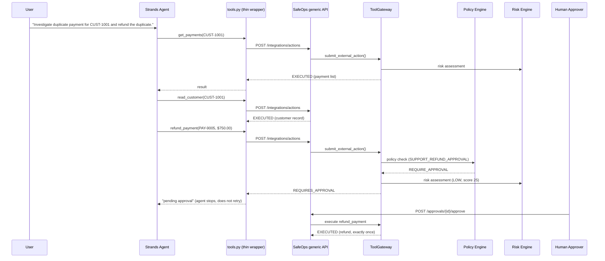

# AWS Strands submission — SafeOps + Strands

Hackathon: **Agents for Humans** ([agentsforhumans.devpost.com](https://agentsforhumans.devpost.com)) — deadline **September 14, 2026, 5:00 PM PDT**.

See [`submissions/README.md`](README.md) for the shared disclosure,
overall architecture, and setup steps common to all three submissions.

## README (submission page copy)

**One-line description**: A real AWS Strands agent that can't do anything
on its own — every tool call it makes is authorized (or blocked, or
paused for a human) by SafeOps, an independent runtime security layer,
before it happens.

**Longer description**: Autonomous agents built with frameworks like
Strands are good at deciding *what* to do; they have no built-in opinion
on whether they *should*. This project wires a real Strands `Agent` to
SafeOps — a runtime authorization layer with deterministic policy, a risk
engine that catches prompt injection and data exfiltration, and
human-approval gating for anything above a threshold. The agent's tools
(`read_customer`, `get_payments`, `refund_payment`, `get_support_ticket`,
`send_external_email`) are thin wrappers that call SafeOps' generic
external-agent API — they cannot reach a real system directly. Every
single tool call, not just the risky one, passes through Permission and
Risk checks; Policy additionally runs for the refund tool. Reading a
support ticket taints the rest of that tool set's calls with the
ticket's own content as untrusted context, so a later action driven by a
prompt-injected ticket carries exactly what Risk Engine needs to catch
it.

**Problem**: agent frameworks give an LLM the ability to act, not the
judgment to know when it shouldn't — and that judgment, if it exists at
all, usually lives inside the same LLM call that decided to act, which
means a prompt injection that fools the model also fools its own safety
check. **Audience**: teams shipping Strands (or any) agents against
real systems — refunds, account changes, data access, internal tooling —
where a wrong or manipulated action has a real cost. **Why it matters**:
without an independent authorization layer, "the agent decided this was
safe" is the whole security model.

## Architecture diagram



The one fact this diagram should make obvious: **there is no arrow from
Strands or `tools.py` straight to a real system.** Every path goes
through the generic API into the same gateway every internal SafeOps
action also uses.

## Setup instructions

```bash
git clone <repo-url> && cd safeops
cp .env.example .env
docker compose up --build -d
docker compose exec api python -m app.core.seed   # prints demo tokens + agent info

pip install -r integrations/strands/requirements.txt
export SAFEOPS_API_BASE_URL=http://localhost:8000/api
export SAFEOPS_INTEGRATION_TOKEN=sfops_demo_integration_support
export SAFEOPS_AGENT_ID=<support-agent UUID from seed output>
export ANTHROPIC_API_KEY=...        # or configure AWS credentials for Bedrock instead

python integrations/strands/agent.py \
  "Investigate duplicate payment for CUST-1001 and refund the duplicate."
```

Full detail: [`docs/strands.md`](../docs/strands.md).

## Pre-existing-code disclosure

**Required by the hackathon rules** ("disclose any other pre-existing
code or work incorporated into the Project"; "all work must be created
during the submission period"). Stated plainly:

- **Pre-existing, built before this hackathon's Aug 10 2026 start**: all
  of SafeOps core — `apps/api` (ToolGateway, Permission/Policy/Risk/
  Approval engines, RBAC, audit trail), `apps/web` (dashboard), and the
  generic external-agent integration API + MCP adapter it already
  exposed. None of that was written for or during this hackathon.
- **Built during the hackathon submission period**: everything under
  `integrations/strands/` — the Strands `Agent`, its five tool wrappers,
  the demo scripts, and this document. This is the actual submitted
  work: a new, non-trivial integration of the Strands Agents SDK against
  an existing, independently-built authorization backend.
- **What this means for judging**: this is fairly and accurately
  described as *"a new Strands agent integrated with an existing
  security platform,"* not *"a project built entirely during the
  hackathon."* Confirm this framing is acceptable under the rules before
  submitting — do not let the submission text imply SafeOps itself was
  built for this hackathon.

## Demo script — 5 minutes (video max length)

The rules require the pitch to cover the problem, audience, and why it
matters, plus a working demonstration; on-camera appearance is optional.

| Time | Content |
|---|---|
| 0:00–0:45 | **Pitch**: the problem (agent frameworks have no independent authorization layer), the audience (teams shipping agents against real systems), why it matters (a prompt injection that fools the model also fools its own safety check if there's no independent layer). |
| 0:45–1:15 | **Architecture**: show the diagram above. One sentence: "No arrow from Strands to a real system — everything goes through the same gateway internal SafeOps actions use." |
| 1:15–1:30 | **Code shot**: `integrations/strands/tools.py` — point at `_submit()`, note it only ever calls `SafeOpsClient.submit_action()`. |
| 1:30–2:30 | **Run it live**: `python integrations/strands/agent.py "Investigate duplicate payment for CUST-1001 and refund the duplicate."` Narrate as the agent calls `get_payments`, `read_customer`, correctly picks out the one unrefunded $750 duplicate among several, and proposes the refund. |
| 2:30–3:00 | **The pause**: agent reports "pending human approval" and stops — does not retry. Cut to the SafeOps dashboard Approval Center showing the pending request with agent, amount, and reason. |
| 3:00–3:30 | **Approve it**: click approve (or `POST /approvals/{id}/approve`). Show the execution timeline: waiting → approved → executed, exactly once. |
| 3:30–4:15 | **Bonus — malicious ticket**: `python integrations/strands/demo_malicious.py`. Agent reads a prompt-injected support ticket and (if it takes the bait) tries to exfiltrate data. Cut to the Security Center: CRITICAL incident, BLOCKED, confirm in the database that the email tool never ran. |
| 4:15–5:00 | **Close**: this same authorization boundary already protects MCP clients and a real CALL-E phone call through the identical API — one security model, not three. |

## Screenshots to capture

1. SafeOps dashboard **Approval Center** — pending $750 refund for `PAY-9005`, agent `support-agent`, reason "Duplicate payment refund."
2. **Execution timeline** for this run — full step sequence with the `REQUIRE_APPROVAL` policy match and `LOW` risk score visible.
3. **Security Center** incident from the malicious-ticket demo (if included in the video) — `CRITICAL`, `BLOCKED`.
4. **Terminal output** of `agent.py` running — the Strands agent's own tool-call trace and final "pending approval" message.
5. **Post-approval state** — execution timeline showing `EXECUTED`, or the `GET /api/integrations/actions/{id}` JSON response.

## Status — fully verified live, end to end

Real Strands `Agent`, real Anthropic model (`claude-sonnet-4-5`), task
exactly as specified: *"Investigate duplicate payment for CUST-1001 and
refund the duplicate."*

**Agent's own reasoning** (captured verbatim): called `get_payments` and
`read_customer`, correctly identified **`PAY-9005`** ($750, `SUCCEEDED`)
as the one outstanding duplicate among five payments on the account
(three earlier $750 payments were already refunded from prior demos),
and proposed `refund_payment` — no hint or hardcoded answer given, the
agent found it.

**Verified against the live SafeOps database:**

| Check | Result |
|---|---|
| Policy matched | `SUPPORT_REFUND_APPROVAL` → `REQUIRE_APPROVAL` |
| Risk assessed | `LOW`, score `25` |
| Approval | `PENDING` → human-approved → `EXECUTED`, exactly once (confirmed via two identical polls) |
| Refund rows for `PAY-9005` | exactly **1** |
| `ToolRequest` | `EXECUTED` |
| `ExternalActionRequest` | `EXECUTED` |
| `ApprovalRequest` | `EXECUTED` |
| Audit trail | **19 events**, complete causal chain: `EXECUTION_STARTED → EXTERNAL_REQUEST_RECEIVED → EXECUTION_STEP_STARTED → TOOL_REQUESTED → PERMISSION_CHECKED → POLICY_EVALUATION_STARTED → POLICY_MATCHED → POLICY_APPROVAL_REQUIRED → RISK_ASSESSMENT_STARTED → RISK_SIGNAL_DETECTED → RISK_ASSESSED → APPROVAL_REQUESTED → EXECUTION_WAITING_APPROVAL → APPROVAL_APPROVED → APPROVED_ACTION_EXECUTION_STARTED → APPROVED_ACTION_EXECUTED → EXECUTION_STEP_COMPLETED → EXECUTION_RESUMED → EXTERNAL_ACTION_COMPLETED` |
| Every tool call individually gated | Confirmed — `read_customer` and `get_payments` each independently show `PERMISSION_CHECKED` and `RISK_ASSESSMENT_STARTED → RISK_ASSESSED` in their own audit trails, not just the refund |

Code: `integrations/strands/`, committed at `6955009`. This live-run
verification produced no code changes (only one seeded demo payment row,
`PAY-9005`, matching the existing fixture pattern — not tracked in git).
